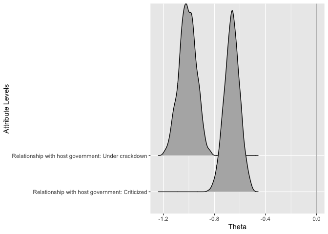
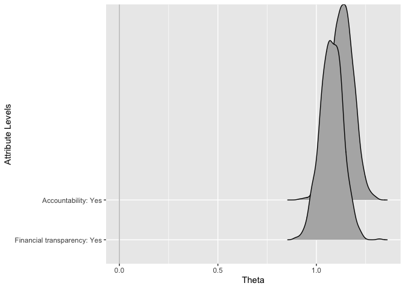
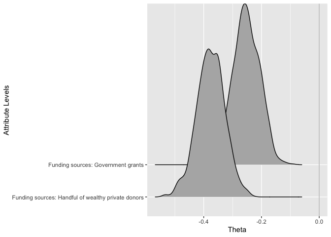
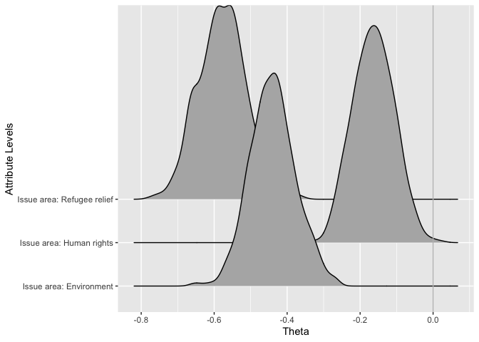

Hypotheses
================

The purpose of this R Markdown is to visualize the results to the hypotheses proposed at the beginning of the paper.

#### In this study, we simultaneously account for the interaction between legal crackdown, issue area, funding source, and managerial practices as well as donor characteristics. We hypothesize that each of these structural and organizational characteristics will have a significant effect on donor behavior, but we’re unsure of the direction of that effect.

    ## Picking joint bandwidth of 0.0165

#### Do donors care if nonprofits they care about are criticized by or kicked out of the countries they work in?

We theorize that structural characteristics like an NGO’s host-country political and legal environment can serve as heuristics and shortcuts for donors. Donors who see that an NGO faces general legal trouble abroad will use that knowledge to decide whether or not to donate.

    ## Picking joint bandwidth of 0.0141

#### Do managerial practices (financial transparency and accountability systems), funding sources (private donations and government grants), and issue areas (emergency response, environmental issues, human rights, and refugee relief) also serve as heuristics that signal an organization’s deservingness to donors?

We theorize that non-structural organizational characteristics like managerial practices, funding sources, and issue area also serve as heuristics and influence donation patterns.

#### 1. Managerial Practices

    ## Picking joint bandwidth of 0.0132

#### 2. Funding Sources

    ## Picking joint bandwidth of 0.0106

#### 3. Issue Areas

    ## Picking joint bandwidth of 0.0148

